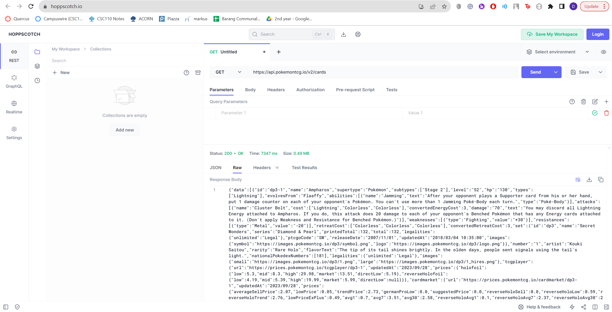
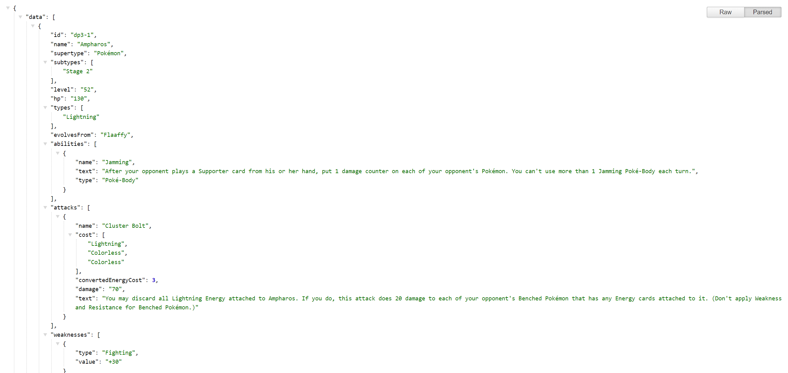
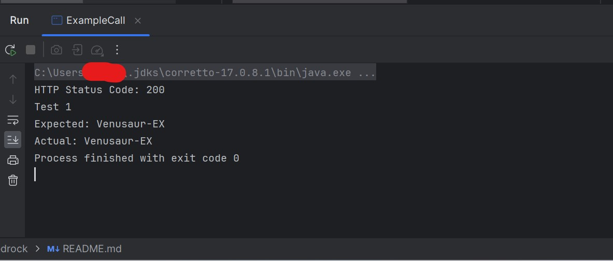

# team bedrock
*week3project submission*

# Problem Domain
Our team's idea for this project will be inspired by the Pokémon Trading Card Game. The API we are currently using 
returns a list of Pokémon cards and their statistics. Even though implementing a simple version of Pokémon would be the 
natural course of action, we think that given the original characters from the Pokémon franchise, implementing some new 
gameplay features such as challenges would be interesting. For example, adding certain gimmicks such as starting with a 
smaller amount of health during fights could be something fun to try out. 

Overall, this project could serve as a potential modification to Pokémon's core gameplay mechanics.

# Our Application
We would like to design an application that will allow us to play the Pokémon trading card game. This means that we will
need to develop several core features; these will form the backbone of the application and ultimately
be used to play the card game.

**Core Features:**
* Player Collection
  * Logs all the cards that a player has acquired.
* Deck Builder
  * Enables the player to build a deck using the cards that are in their collection.
* Gameplay
  * Create an instance of the card game. A loop will run for each player's turn. The game ends when a player wins, or 
    someone has forfeited.

Beyond the core features, we have some other ideas for functions that we think would be fun. For now, we will call these
the complementary features.

**Complementary Features:**
* Booster Packs
  * A tool for players to extend their card collection. In the real-life Pokémon card game, there are rules for the
    number of cards and the rarity of cards that can be included in a single booster pack: we will likely follow those 
    same rules
* Currency System
  * The inclusion of a currency system will enable a way to acquire booster packs. It can also be used to encourage
    players to win their games, through currency rewards.
* Experience System
  * We can implement an experience tracker to encourage players to keep playing the card game, even if they have trouble
    winning. Experience can be awarded on both losses and wins, with wins giving more experience than losses. Upon
    reaching certain thresholds of experience, players will "level up", and earn rewards. Rewards can be booster
    packs or pre-determined cards.

# API of Choice
The API we've chosen to work with is called [PokémonTCG](https://pokemontcg.io). It provides an extensive database of 
Pokémon cards which we can use to build player collections and decks, which can then be used to play the game. It is a 
REST API that uses the standard HTTP codes for queries. When queried, it will return Pokémon cards in JSON format.

## Link to Documentation &rarr; [PokémonTCG](https://docs.pokemontcg.io)

## Using External Tools to try the API
Using Hoppscotch, we get the following 

Alternatively, clicking this [link](https://api.pokemontcg.io/v2/cards) returns the following. This JSON has been 
formatted using the JSON Formatter extension on Google Chrome.

## Example Java Output

Our example Java code showcases an API request to fetch the name of a Pokémon card by specifying its unique card ID.
The output demonstrates the expected result and the actual result. In this case, our code fetched the name of the Pokémon 
card associated with the card ID 'xy1-1', which is 'Venusaur-EX'.

# Technical Problems
